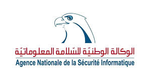
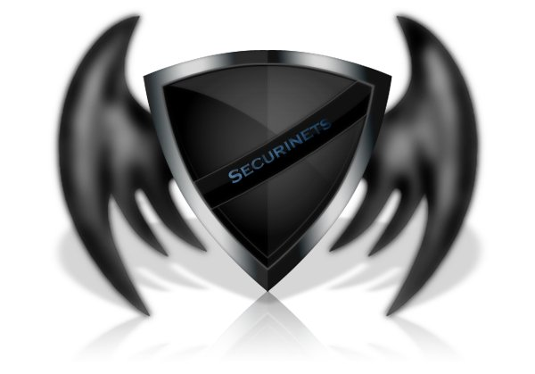
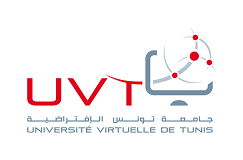
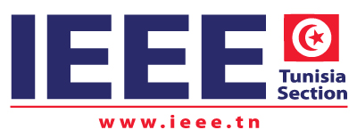

The Open Web Application Security Project (OWASP) is a nonprofit foundation that works to improve the security of software. All of our projects ,tools, documents, forums, and chapters are free and open to anyone interested in improving application security. 

Follow chapter news on  [Facebook](https://www.facebook.com/OWASP.Tunisia.Chapter.Official) ,   [Linkedin](https://www.linkedin.com/groups/8591169/), [Youtube](https://www.youtube.com/channel/UC1M1Ppxbbi3HoYBpqYKjlgA) and [Meetup](https://www.meetup.com/fr-FR/OWASP-Tunis-Meetup-Group/)
We schedule our meetings on the [Meetup](https://www.meetup.com/OWASP-Tunis-Meetup-Group/)

### PAST EVENT- 1 September 2023 7PM(GMT+1) !! Scheduled via Meetup https://www.meetup.com/fr-FR/owasp-tunis-meetup-group/events/ 
Workshops on

- "Exploring LLM Vulnerabilities with OWASP TOP 10 for LLMs"
  by Alyssa Berriche : Lead Cyber Threat Intelligence Analyst. 
- "Code Red: Deciphering the Depths of Active Directory Security"
  by Foued saidi: Technical Director @Securinets ISI Club. Top HacktheBox Tunisia, Top60 HacktheBox WorldWide

### Previous EVENT- 28 April 2023 7PM(GMT+1) Workshop on Small Coding Mistakes , Big Security Risks
Speaker: Mohamed Adib Boukthir
[View Youtube Video](https://www.youtube.com/watch?v=t29diy_Jk_c)

<!---->

Our meetings are open to the public, and you do not need to be a member to attend. Please do consider [joining OWASP](https://owasp.org/membership/) if you find our community, projects, and meetings valuable, or sponsoring this chapter.

### Meeting Supporters

The following is the list of organisations who have generously provided us with space for OWASP Tunisia chapter meetings.
Thank you for your contribution.

<!---->

The following is the list of organisations/Foundations who have generously help us to communicate about OWASP projects and OWASP Tunisia chapter activities. Thank you for your contribution.

   

<!---->

## Among our PAST EVENTS (See PASTEVENTS)! 

#### Mobile app Pentest and Security

#### OUR Speaker ! Ahmed Abdallah, Senior Solutions Architect and Cyber Security Consultant. OWASP Dubai Chapter Leader

#### Securing Mobile Apps with the OWASP MASVS Standard. Our Journey to v2.0. [NEW NEW!!] 
##### With our Honorable Guest ! Carlos Holguera Mobile security research engineer. NowSecure . Project Leader @OWASP Mobile Security Project
Join us via https://www.meetup.com/fr-FR/owasp-tunis-meetup-group/events/286694349/

### OWASP Tunisia Chapter Local Meeting at NACS (National Agency of Computer Security)20 October 2021!
[View the video on our Youtube Channel](https://www.youtube.com/watch?v=Ja4Jot0trVM)

### Hands-On - Static Analysis Security Testing (SAST) in CI/CD - 20 May 2021 at 8 PM UTC+1

#### OUR GUEST: Raouf Mnif -Devops Architect at Baaz

Raouf Mnif Spent 10 years developing the skills to increase velocity, reliability, and quality with a high focus on security.
Good experience with AWS, Docker, Kubernetes, and ArgoCD, helping organizations instill Devops for the modern ag

[Take your ticket Now and subscribe to our Meetup OWASP Tunis Group!](https://www.meetup.com/fr-FR/OWASP-Tunis-Meetup-Group/events/277851439)

### April/May 2021 - Common Project about Software Security Awarness with National Agency of Computer Security !

### OWASP SAMM2 - Your Dynamic Software Security Journey - 29 January 2021 at 12pm CET

[Take your ticket and subscribe to our Meetup OWASP Tunis Group!](https://www.meetup.com/fr-FR/OWASP-Tunis-Meetup-Group/events/275749110)

#### Our Guest: Sebastien Deleersnyder 

Sebastien Deleersnyder (https://twitter.com/sebadele) is co-founder, CEO of Toreon and a proponent of application security as a holistic endeavor. He started the Belgian OWASP chapter, was a member of the OWASP Foundation Board and performed several public presentations on Application Security. Seba also co-founded the yearly security & hacker BruCON conference and trainings in Belgium. With a background in development and many years of experience in security, he has trained countless developers to create software more securely. He has led OWASP projects such as OWASP SAMM, thereby truly making the world a little bit safer. Now he is adapting application security models to the evolving field of DevOps and is also focused on bringing Threat Modeling to a wider audience.

#### Description

OWASP Software Assurance Maturity Model (SAMM) enables you to formulate and implement a strategy for software security that is tailored to the risk profile of your organisation. In this talk, we give an overview of the new release of the SAMM model. After 10 years since its first conception, it was important to align it with today’s development practices. We will cover a number of topics in the talk:
the core structure of the model, which was redesigned and extended to align with modern development practices, the measurement model which was setup to cover both coverage and quality and the new security practice streams where the SAMM activities are grouped in maturity levels. We will demonstrate the new SAMM2 toolbox to measure the maturity of an example development team and how you can create a roadmap of activities.

### LAST ONLINE  EVENT! Blockchain [for] Security - 5-12-20

<!-- Meetup : [Register and join the event !](https://www.meetup.com/fr-FR/OWASP-Tunis-Meetup-Group/events/274884238/)-->

<!-- Youtube: [Subscribe/Follow us via our Youtube Channel!](https://www.youtube.com/channel/UC1M1Ppxbbi3HoYBpqYKjlgA)-->

#### Abstract 

Blockchain is a disruptive  technology proposing some security properties for various digital applications. 
But Blockchain has also its own challenges in terms of security......

##### "Blockchain as a security brick for software applications" by Sami Bel Hadj

Sami is Technical/Software Dev Manager with more than 18 years’ experience designing, developing and supporting software systems. Creative and dynamic Engineer with proven expertise in effectively leading technical teams.
His professional strengths include extensive database technology expertise, team leadership and management, strong oral and written communication skills, and ability to achieve corporate objectives in challenging work environments. Sami is also  professor of Blockchain technology / philosophy in several Tunisian universities.
[PDF](assets/images/Blockchain_Security_OWASP.pdf)

##### "Pen testing Blockchain Solutions (Ethereum Smart Contracts & Nodes)" By Alex Devassy 

Alex is Cyber Security Professional, having 2+ years of rich and insightful exposure in Red Teaming, security consultancy along with cyber security training. Focused on Penetration testing of commercial off-the-shelf applications, Web Application, Web Service, Network PT including Active Directory, SAP, IOS,  Blockchain and Salesforce applications using open source and commercial tools. Experienced in developing automation / malicious scripts in windows PowerShell, node js. Have been a part of the winning team at IIT Delhi, Open Innovation Blockchain Hackathon, conducted by Best of Block Inc.

##### "Secured Smart Contracts Development using SCSVS" by Damian Rusinek

Damian is Senior IT Security Specialist, since 2016 in SecuRing. Professionally responsible for web and mobile application audits and source code analysis. Software developer and analyst with over a decade of experience. Mainly focused on the cryptographic protocols, distributed ledger technologies and applications that use them.

Finished PhD at Warsaw University of Technology. Damian works as researcher at Maria Curie Sklodowska University in Lublin where his main topic of research are biocrypto and blockchain based protocols and applications. Author of several academic research papers and speaker at such conferences as Cryptography and Security Systems, International Science Conference on Computer Networks, Confidence, Confidence London, AppSec EU, InfoShare.
Creator of Smart Contracts Security Verification Standard.
[PDF](assets/images/OWASP-Tunis-Chapter-2020.pdf)

### Previous Event- Hands-on on Secure Programming & Secure Coding Standards 13-07-20

[Subscribe/Follow us via our Youtube Channel!](https://www.youtube.com/channel/UC1M1Ppxbbi3HoYBpqYKjlgA)

<!--[Take your Ticket Here!!!](https://www.eventbrite.com/e/hands-on-on-secure-programming-secure-coding-standards-tickets-113083056466)-->

#### Our Speaker - Azzeddine RAMRAMI

    - IBM Security - Senior Security & Network Architect
    - OWASP Morocco Chapter
    - OWASP AppSec Africa President
    - Data & Application Security, Cogntive Security, IoT/OT/ICS/SCADA Security & SIEM
    - Professor/instructor and an expert information security development with over 22 years of 
       experience in the security, secure coding, network and telecommunication arena.
    - Certified Mile2 CPTE/CPTC/CDFE/CSWAE and EC-Council C|EH

#### Hands-on Description
Generally, it is much less expensive to build secure software than to correct security issues after the software package has been completed, not to mention the costs that may be associated with a security breach. We will discuss how to embed security in the SDLC and how to design a secure application architecture.

The following areas will presented:

     1. Software Security and Risk Principles Overview
     2. Secure Coding Standards for Java, C/C++
     3. Secure Coding Practices Checklist
         - Input Validation
         - Output Encoding
         - Authentication and Password Management
         - Session Management
         - Access Control
         - Cryptographic Practices
         - Error Handling and Logging
         - Data Protection
         - Communication Security
         - System Configuration
         - Database Security
         - File Management
         - Memory Management
       4. General Coding Practices & Code Quality

### Thanks

Thanks [IEEE Tunisia Section]( https://www.ieee.tn/) !! to be among our valued partners.

and Thanks again to:

 -  [ANSI National Agency of Computer Security]( https://www.ansi.tn/)
 -  [UVT Tunis Virtual University]( https://www.uvt.rnu.tn/)
 -  [SecuriNets]( https://www.securinets.com/)

 for helping us to further develop national software security awarness and extend our OWASP Tunisia community!

### Speaking at OWASP Tunisia Chapter Events
If you would like to present a talk on Application Security at future OWASP Tunisia Chapter events - please review and agree with the [OWASP Speaker Agreement](https://www.owasp.org/index.php/Speaker_Agreement) and send the proposed talk title, abstract and speaker bio to the Chapter Leader via e-mail: nihel.benyoussef (at) owasp.org
Please mention in email's subject : Tunisia Speaker request-your name 

###  Event/meeting TICKETS!
All events/meetings are free to attend for both members and non-members of OWASP and are open to anyone interested in application security and cyber security. Please note that for our future events, you MUST REGISTER to book your place and get a ticket to be admitted to the event - your name will be checked against the guest list. Please note that generally the space are limited, so please only book tickets if you are able to attend!

