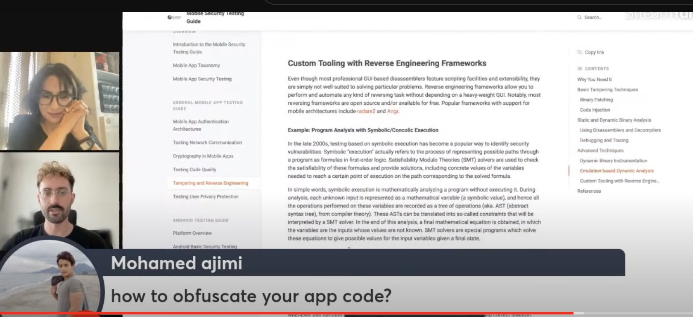
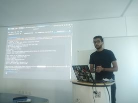

## Past Events

**5 September 2024 at 3pm UTC+1** 
Co-organizer: OWASP Algiers chapter!- I[OT]Security 25th October 2024 at 7pm UTC+1 on OWASP Tunisia youtub

#### Topic: “GraphQL Vulnerabilities in the Wild: A Hands-On Workshop with OWASP TOP 10 Insights”

#### Speaker: Antoine Carossio, Co-founder & CTO of Escape

**2023-9-01** Online Workshops co-organized with SecuriNets association
- "Exploring LLM Vulnerabilities with OWASP TOP 10 for LLMs"( Last version 26 August 2023)
  by
#### OUR Speaker !
####   Alyssa Berriche : Lead Cyber Threat Intelligence Analyst at Cimpress/Vistaprint.Former president of Securinets INSAT club

- "Code Red: Deciphering the Depths of Active Directory Security"

#### OUR Speaker !
####  Foued saidi: Technical Director @Securinets ISI Club. Top HacktheBox Tunisia, Top60 HacktheBox WorldWide
  

[View the video on our Youtube Channel](https://www.youtube.com/watch?v=8j_2FO0QSIg)

|

**2023-4-28** Workshop- Small Coding Mistakes, Big Security Risks" 

#### OUR Speaker !
#### Mohamed Adib Boukthir, Cyber Security Pentester,EY Tunisia

[View the video on our Youtube Channel](https://www.youtube.com/watch?v=t29diy_Jk_c&t=4165s)

|
**2022-12-17** Workshop- Mobile app Pentest and Security

#### OUR Speaker !
#### Ahmed Abdallah, Senior Solutions Architect and Cyber Security Consultant. OWASP Dubai Chapter Leader

[View the video on our Youtube Channel](https://www.youtube.com/watch?v=W8wFjjvsPZo&t=154s)

|

**2022-06-24** Workshop- Securing Mobile Apps with the OWASP MASVS Standard. Our Journey to v2.0

[View the video on our Youtube Channel](https://www.youtube.com/watch?v=mQbYm1UKNXE)

#### OUR Speaker !
#### Carlos Holguera. Mobile security research engineer working. NowSecure  Project Leader, OWASP Mobile Security Project

|

**2022-3-2** OWASP Tunisia Local Meeting at National Agency of Computer Security
[View the video on our Youtube Channel](https://www.youtube.com/watch?v=BoICPgU6oLc&t=7927s)

#### OUR Speakers!

#### Mondher Smii , Chef de service information Sharing & Analysis Center at ANSI(National Agnecy of computer Security)
#### Hajji Wajih , OWASP member, Lead cyber security engineer at Ernst and Young (EY)
#### Sofien Maatallah, Cyber-security Expert at National Agency of Computer Security, Head of computer security incident response team at (National Agnecy of computer Security)
#### Baha Baghdadi, Cyber security consultant and penetration tester at EY Tunisia, 

|
|
|

**2022-2-19** All about OWASP and OWASP top 10 2021
[View the video on our Youtube Channel](https://www.youtube.com/watch?v=jalQ-eL-jWY&t=7s)
#### OUR Speaker!

#### Vandana Verma - OWASP Board of Directors Chair, OWASP Bangalore chapter leader,Security Leader at Snyk
|
|

**2021-10-20** OWASP Tunisia Chapter Local Meeting at NACS (National Agency of Computer Security)!
[View the video on our Youtube Channel](https://www.youtube.com/watch?v=Ja4Jot0trVM)
#### OUR Speakers!

#### Abdelkader Ben Ali- cyber threat intelligence analyst @ODDO-BHF CSIRT. "Mapping OWASP TOP 10 2021 TO ATT&CK"
#### Ahmed Belkahla - Cyber Security Specialist at Yogosha, technical director at Securinets National Association.  "Workshop on APIs Business Logic Flaws"
#### Alyssa Berriche -Lead Cyber Threat Analyst @ Cimpress, Instructor @ Cybrary. "Boosting Security Operations and Response using Orchestration and Automation"

|
|

**2021-5-20** Hands-On - Static Analysis Security Testing (SAST) in CI/CD - 20 May 2021 at 8 PM UTC+1
[View the video on our Youtube Channel](https://www.youtube.com/watch?v=NGTl6jURn3Q)
#### OUR GUEST: 
Raouf Mnif -Devops Architect at Baaz

**2021-1-29** OWASP SAMM2 - Your Dynamic Software Security Journey
[View the video on our Youtube Channel](https://www.youtube.com/watch?v=IaVeLHia43w)

##### Our Ghest: 
- Sebastien Deleersnyder is co-founder, CEO of Toreon, OWASP Belgium Chapter co-Leader, OWASP SAMM project co-leader

|

**2020-12-5** Online Event- Blockchain [for] Security
[View the video on our Youtube Channel](https://www.youtube.com/watch?v=fRQrJttI5vI)

##### Our Ghests: 
- Sami BelHadj. Senior Technical/Software Dev Manager at ODOO BHF and Blockchain professor
- Damien Rusinek. Senior IT Security Specialist at Securing and PhD in biocrypto and blockchain based protocols and applications.
- Alex Devassy. Security Analyst at EY and have been part of winning team at IIT Delhi, Open Innovation Blockchain Hackathon.

**2020-07-13** Online Event- Hands-on on Secure Programming and Secure Coding Standards
[View the video on our Youtube Channel](https://www.youtube.com/watch?v=X0AA2lubSSs)

##### Our Ghest: 
Azzedine RAMRAMI. Senior Security & Network Architect-IBM Security.
                  OWASP Morocco Chaper Leader
                  OWASP Appsec Africa President

|

**2020-05-23** Virtual Event- Presentation of OWASP Foundation and OWASP Tunisia Chapter and Hands on Pwing with OWASP Juice Shop
[View the video on our Youtube Channel](https://www.youtube.com/watch?v=p_I8noAb5dE)

##### Our Ghest: 
Wajih HAJJI. OWASP member. Cybersecurity and Multi Cloud Management Engineer. Ditriot Consulting

**2020-01-16**. Participation at 3rd edition of TT Security Day "Cybersécurité et Confiance numérique , clés de la transformation digitale". Table ronde sur les challenges en sécurité des nouvelles tendances technologiques. Présentation des projets et publications OWASP autour de  "Security and privacy by design"

|
|
**2019-11-16**. Local OWASP Tunisia Chapter Meeting.Cercle des bureaux. Centre Urbain Nord. Tunis. Thanks for Axians Cybersecurity for Hosting the event

|

**2019-04-14** Participation of OWASP Tunisia Chapter, SecuriDay2K19 Event : National Security Day. Privacy and Personal Data Protection. With SecuriNets Foundation . INSAT.Tunis.

|
|

**2019-02-23** : Participation of OWASP Tunisia Chapter, "The art of DevSecOps" Event with SecuriNets Foundation: Presentation of OWASP DevSecOps projects.@ SecurinetsISI Acropolium de Carthage. Tunis. Speaker: Raouf Mnif DevOps Engineer, Futura Digital

|
|

**2018-06-29** : OWASP Tunisia Chapter, Workshop on OWASP IOT PROJECT and Demo : Exploiting Command injection Vulnerability in firmware using Firmware analysis Tool, Firmadyne, binwalk) and OWASP ZAP : Carthage Cyber Arena CCA 2018 @Arena Lac (Guest Lecture). Speaker: Nihel Ben Youssef. OWASP Tunisia Chapter leader.

|

**2018-03-08** : Workshop on Big DATA Security and OWASP NoSQL injection Demo: Hackathon BigDATA @FSJEG (Guest Lecture). Speaker: Nihel Ben Youssef. OWASP Tunisia Chapter leader.

|

***2018-03-03**: Presentation of OWASP Foundation and OWASP Tunisia Chapter: Ebanking CyberSecurity Event organized by SECURINETS_ISI @Pôle El Ghazela (Guest Lecture)

**2017-04-06 : Workshop: Introduction to the OWASP Top 10 Mobile Security Risks @ISET RADESBy Abdessabour Arous, Past OWASP Tunisia Chapter**

|

**2017-03-08**: Workshop: Introduction to the OWASP Top 10 IoT Security Risks @SECURINETS ISI

|

**2017-02-19** : OWASP Tunisia Chapter, "Project Zero" Project Meetup

**2017-02-16**: OWASP Tunisia Chapter contributed to the Rounde Table: "Table Ronde sur la sécurité de l'information" @UIT - Université Internatioanle de Tunis

